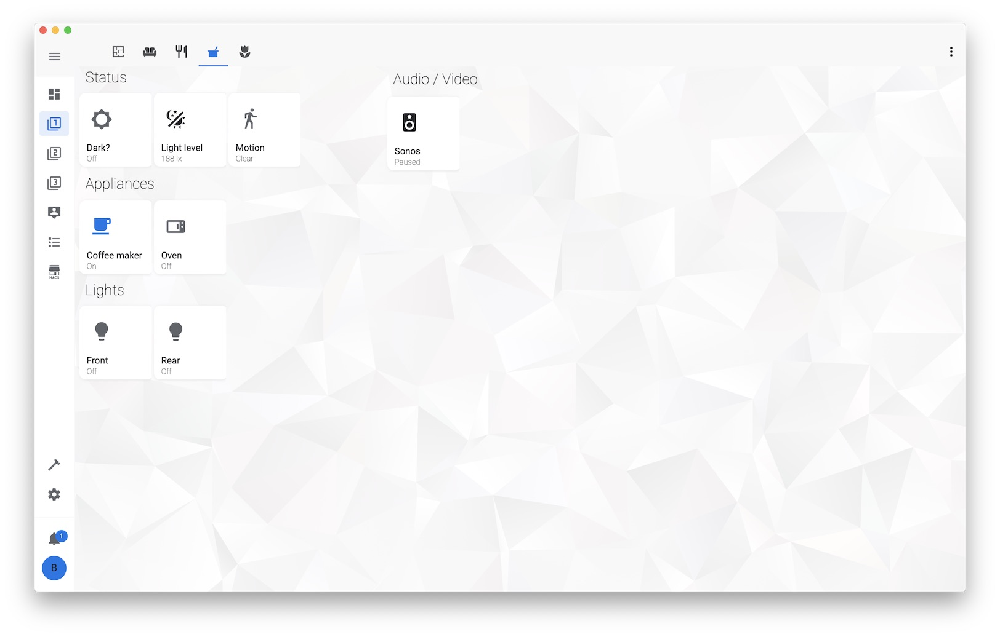

# Home Assistant Configuration

[Home Assistant Core](https://home-assistant.io/) running on [my Kubernetes cluster](https://github.com/bjw-s/k8s-gitops)

If you like anything here, Be sure to :star2: my repo!

## Some features
* Files are split up as much as possible, to keep things reusable
* Multiple dashboards to show information per floor
* Custom dashboards for wall-mounted tablets
* Extensive use of [button-card](https://github.com/custom-cards/button-card) to design the UI
* Many custom cards from [@thomasloven](https://github.com/thomasloven/) to add additional features to the UI
* Automatic theme switching
